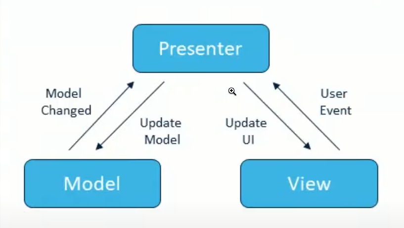

**Инкапсуляция** - это свойство системы, позволяющее объединить данные и методы, работающие с ними в классе, скрыв детали реализации и защитив от пользователя этого класса объектов.

**Наследование** - это свойство системы, позволяющее описать новый класс на основе уже существующего, с частичной или полностью заимствующейся функциональностью.
Класс, от которого производиться наследование, называться базовым или родительским.
Новый класс - потомком, наследником или производным классом.

**Полиморфизм** - это свойство системы, использовать объекты с одинаковым интерфейсом без информации о типе и внутренней структуре объекта.
*Полиморфизм* - способность использовать объект вне зависимости от его реализации, благодаря, полиморфной переменной - это переменная, которая может принимать значения разных типов.

**Параметрический полиморфизм** - если тип наперед не известен.


**Абстракция** - это свойство системы, позволяющее описать общие характеристики базового класса для всех его производных классов, а наполнение деталями предоставляется каждому из этих классов.
В абстрактном классе определяются лишь общие поля и характеристики методов, которые должны быть конкретно реализованы в производных классах, а не в самом базовом классе.

**Интерфейс** *(interface)* - предназначен для описания исключительно общего поведения сущностей. **Частный случай:** для гарантий, реализации некоторого поведения.
**Интерфейс** - это частный случай класса. Он представляет собой полностью абстрактный класс с абстрактными членами.

**Переиспользование кода*

**Отправка сообщений*
___

#### Превращение типов в иерархии (см. лекцию 2.Ex004)
**DownCast** от основного класса к наследнику (BaseHero --> Druid)

**UpCast** от наследника к основному классу (Druid --> BaseHero) 

!Но, скастовать (DownCast) Druid в Dwarf нельзя, без предварительного UpCast-а до BaseHero.


#### Обобщения
```text
Жизненная необходимость сохранения типа "Type save";
Ошибки компиляции лучше ошибок выполнения;
Переиспользование кода "Reusable Code";
Не нужно писать много одинакового кода, привязку типа можно вынесли как уровень абстракции*;
Проектирование уровня экземпляров класса;
Не работает для статики.
```
 
#### Компоненты приложения (mvp)

