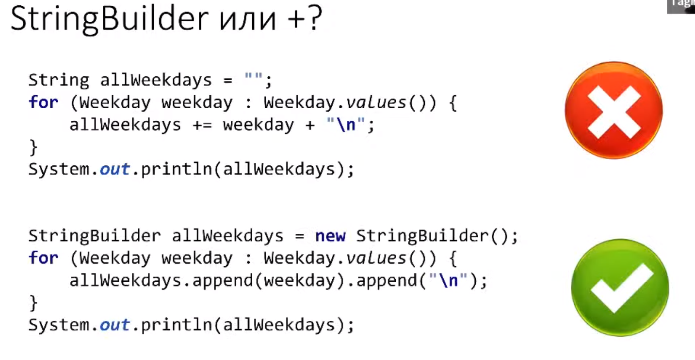

### Программирование на Java, Тагир Фаридович Валеев

[url](https://compscicenter.ru/courses/java/nsk/2022-spring/)

")

#### Классы

(стол - объект, идея стола - класс)

#### Метод

#### Конструктор

#### Объекты

- неизменяемый объект
  
- record (неизменяемый объект) данные и ничего, кроме данных.
  

- статические члены класса
  
- Утилитные классы
  
- Методы Object
  
  (верхние три и нижние два можно переопределять)

Пакеты это просто свалка ...

### Strings

Может быт i с точкой, а может быть и нет. лол.

### Лекция 6.

Коллекции расширяют Iterable

- Множества = Set
  Не содержат повторяющихся элементов
  Пока элемент лежит Set изменять его нельзя!
  Нужно забрать, поменять и положить обратно!

- Списки

-

