# Map, hashcode, компараторы

Queue<E> extends Collection<E>
- offer/add
- poll/remove
- peek/element (Возвращают null/false, если не вышло)

Deque<E> extends Queue<E>
- offerFist/addFirst
- offerLast/addLast
- pollFirst/removeFirst
- pollLast/removeLast
- peekFirst/getFirst
- peekLast/getLast

Стандартные очереди:
- ArrayDeque - изменяемая очередь общего назначения
- PriorityQueue - изменяемая очередь с приоритетом (heap-based)

Не надо использовать!
- Enumeration -> Iterator;
- Vector -> ArrayList;
- Stack -> ArrayDeque;
- Dictionary -> Map;
- Hashtable -> HashMap;
- LinkedList -> ArrayList/ArrayDeque;

### Map
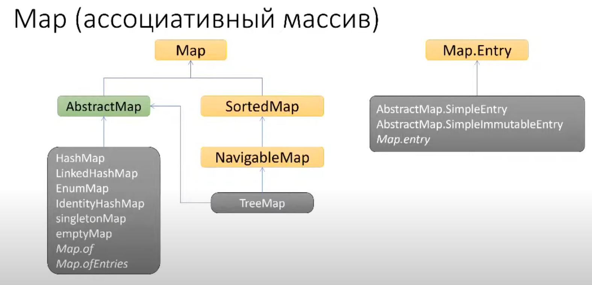
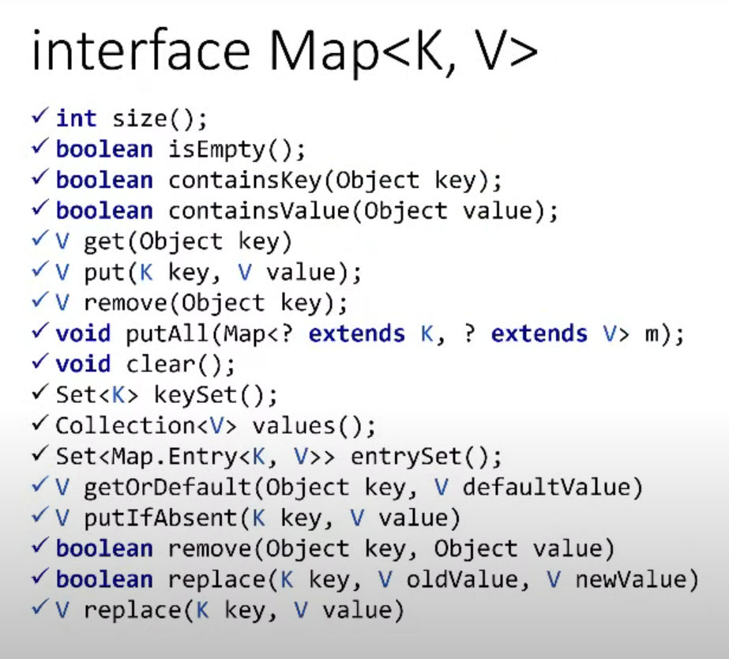
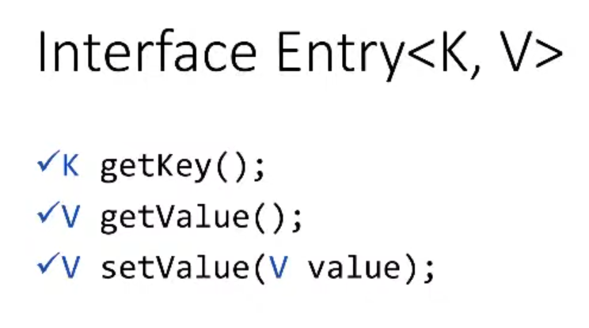
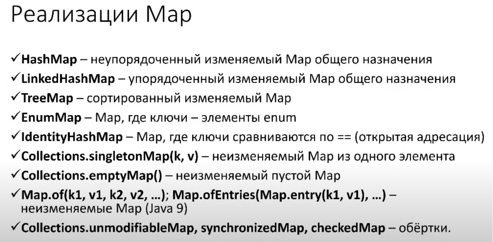
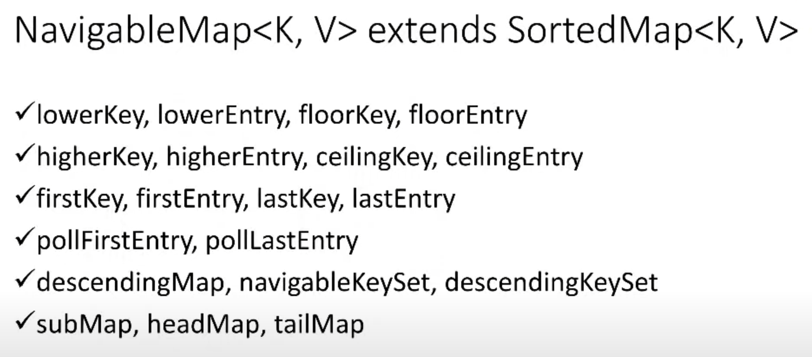
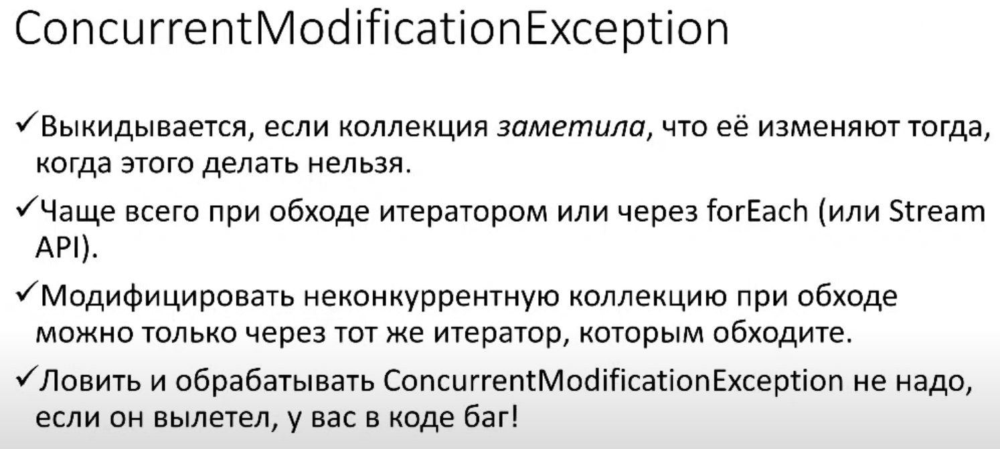

### hashCode
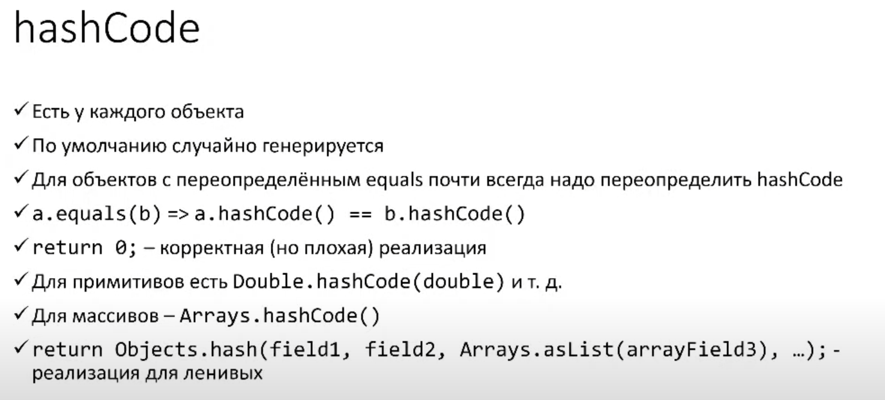
- почему на 31? (операция быстрая, чем умножение в среднем)
- потому что при умножении на 31 нужно сдвинуть на 5 бит (32), а потом вычесть само число
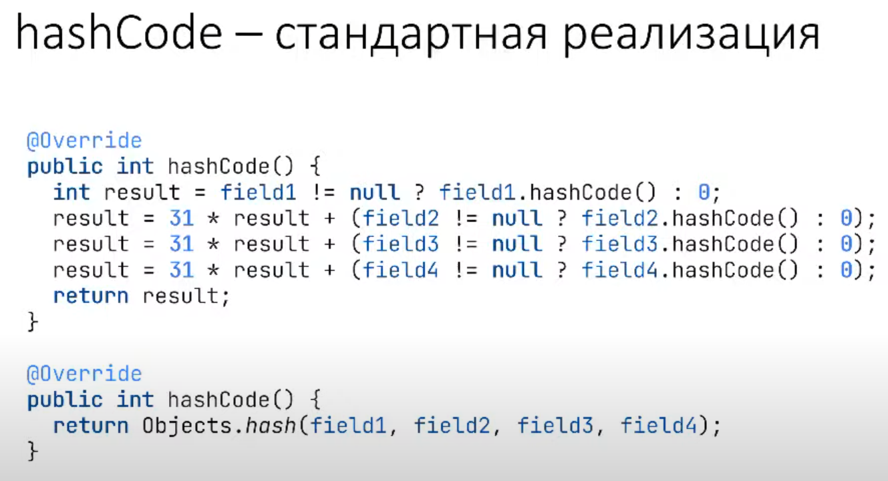

### Comparable
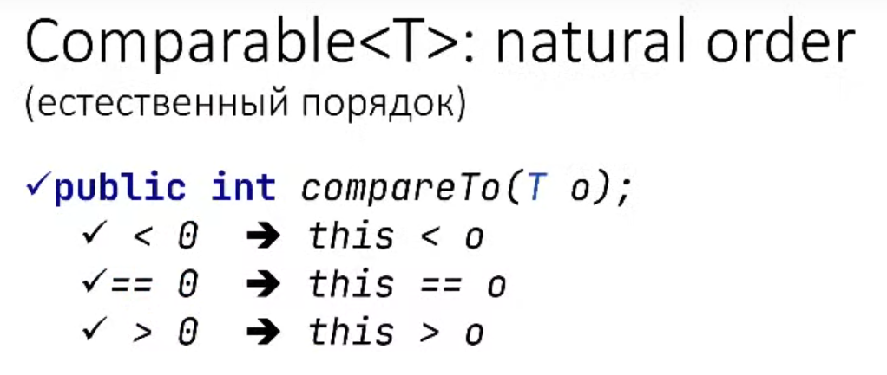
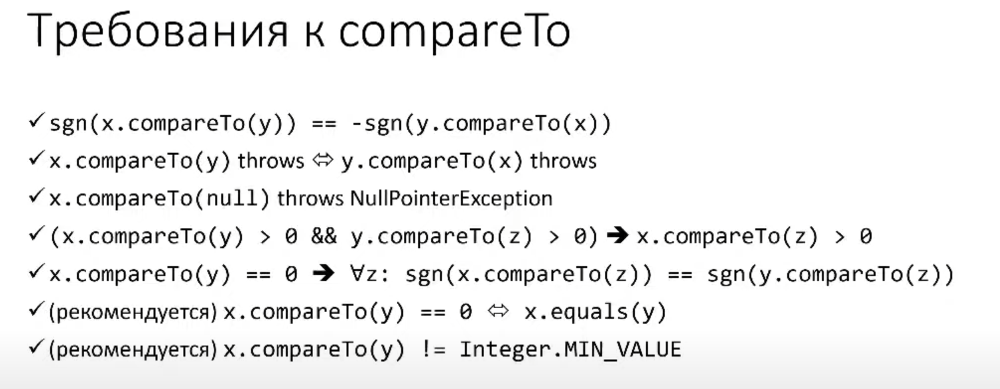

### Comparator
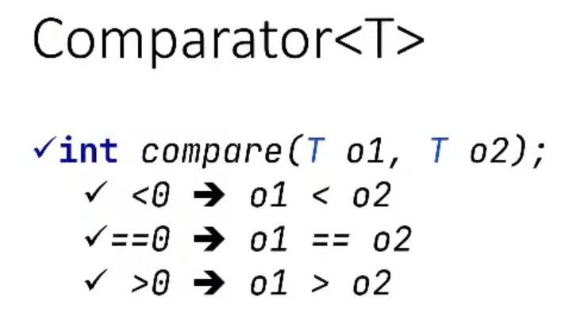
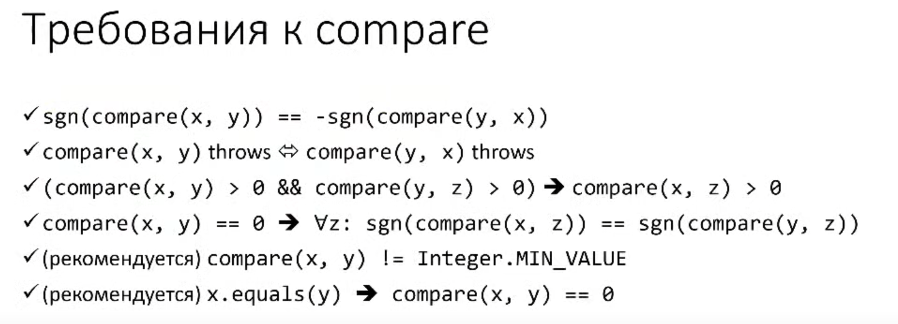

