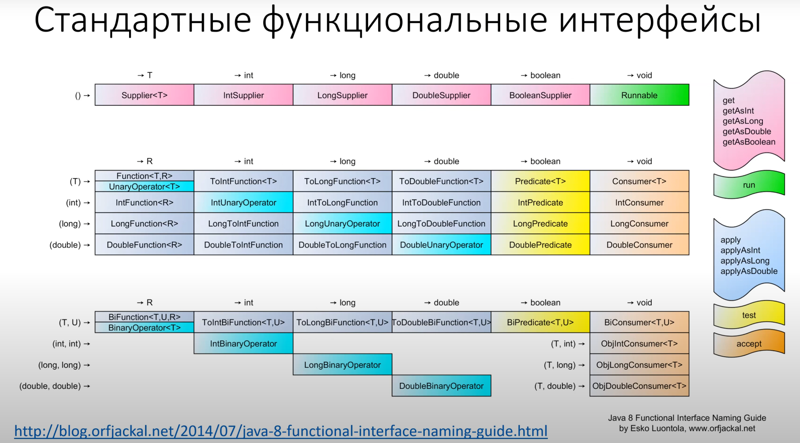

### Лекция 8. Элементы функционального программирования. Stream API

**Интерфейс** (не абстрактный класс), содержащий единственный абстрактный метод (single abstract method - **SAM**).
Может быть аннотирован как __@FunctionalInterface__.

Функциональное выражение в Java
- Отображается не функциональный интерфейс
- Не имеет состояния
- Конкретный тип устанавливается по контексту
- Либо лямбда-выражение ((a,b) -> a+b), либо ссылка на метод (Integer::sum)
- Не гарантируется identity
- Не гарантируется getClass() identity

### Лямбда-выражения
- Аргументы:
    - (Type1 name1, Type2 name2)
    - (name1, name2)
    - Name
- Стрелочка ->
- Тело:
    - Выражение System.out.println()
    - Блок { System.out.println(); }

### Void-compatible (void SAM):
- БлокЖ каждый return не содержит выражения
- Выражение: допустимое в утверждении (вызов метода, присваивание и т.д.)
### Value-compatible (non-void SAM):
- Блок: каждый return содержит выражение и нормальное завершение невозможно.
- Выражение: имеет значение не void

### Захват (capture) значений
- _Локальная переменная_ - должна быть effectively final и инициализирована к месту использования лямбды, берётся её значение
- _Поле текущего класса_ - захватывается this, значение из поля читается при выполнении
- _Статическое поле_ - ничего не захватывается, значение читается при выполнении
- _Closure_ (замыкание) - лямбда-выражение с захваченными переменными

### Ссылка на метод (method reference)
- Статический метод:```IntBinaryOperator sum = Integer::sum;```
- Нестатический метод (первый параметр SAM-метода превращается в квалификатор):
``` Function<String, String> trimmer = String::trin; // res = trimmer.apply("  hello   "); ```
 - Нестатический метод привязанный к экземпляру(instance-bound):
```
Predicate<String> isFoo = "foo"::equals;
Consumer<Object> printer = System.out::println;
```
- Конструктор:
```Supplier<List<String>> listFactory = ArrayList::new;```
- Конструирование массива:```IntFunction<String[]> arrayFactory = String[]::new;```

### Примитивы функционального программирования
 - Композиция функций:``` h = f • g; h(x)=f(g(x))```
```java
default <V> Function<V, R> compose(Function<? super V, ? extends T> before) {
    Objects.requireNonNull(before);
    return (V v) -> apply(before.apply(v));
}
```
 - Привязка аргумента (bind):
```java
static <A, B, C> Function<B, C> bind(BiFunction<A,B, C> fn, A a) {
    Objects.requireNonNull(fn);
    return b -> fn.apply(a, b);
}

Function<Integer, Integer> inc = bind(Integer::sum, 1);
System.out.println(inc.apply(10));
```
- Карирование (curry) (Haskell Brooks Curry):
```java
stati <A, B, C>
Function<A, Function<B, C>> curry(BiFunction<A, B, C> fn) {
    return a -> b -> fn.apply(a, b);
}

System.out.println(curry(Integer::sum).apply(5).apply(6));
```




### Optional<T>
- Либо значение (не null), либо его отстутствие
- Optional.of(obj)
- Optional.ofNullable(obj)
- Optional.empty()

```java
static Optional<Integer> toInteger(Stirng opt) {
    try {
        return Optional.of(Integer.valueOf(opt));
    }
    catch (NumberFormatExepction ex) {
        return Optional.empty();
    }
}
```
```java
// filter(Predicate<T>)
boolean isFooEqualsBar = Optional.of("foo").filter("bar"::equals).isPresent();

// <U>map(Function<T,U>)
String trimmed = Optional.of("  foo  ").map(String::trim).get();

// <U>flatMap(Function<T, Optional<U>>)
Integer num = Optional.of("123").flatMap(x -> toInteger(x)).orElse(-1);

// orElseGet(Supplier<T>)
Double random = Optional.<Double>empty().orElseGet(Math::random);

// <X extends Throwable> orElseThrow(Supplier<T>)throws X
Double random = Optional.<Double>empty().orElseThrow(Exeption::new);

// or(Supplier<? extends Optional<? extends T>>)
getOneOtional().or(() -> getAnotherOptional());
```

### Stream API (java.util.stream)

- Поток однотипных данных для однотипной обработки
- Источник создаёт ленивый стрим
- Промежуточные операции описывают рецепт обработки, но ничего не делают
- Вся работа производиться при вызове терминальной операции
- Может потребить не все элементы
- Может быть бесконечным и завершиться за конечное время

```java
source.stream()
        .map(x -> x.squash())
        .filter(x -> x.getColor() != YELLOW)
        .forEach(System.out::println)
```
Специализации
- java.util.stream.Stream
- java.util.stream.IntStream
- java.util.stream.LongStream
- java.util.stream.DoubleStream

Источники
 - Stream.empty()
 - Stream.of(x,y,z)
 - Stream.ofNullable(x) -Java9
 - Stream.generate(Math::random)
 - Stream.iterate(val, x->x+1)
 - Stream.iterate(0, x-> x<100, x->x+1) - Java9
 - collection.stream()
 - Arrays.stream(array)(int/long/double/Object)
 - Random.ints() /longs()/doubles()
 - String.chars()
 - Pattern.splitAsStream()

Промежуточные операции
- map (mapToInt/mapToLong/mapToDouble/mapToObj)
- filter
- flatMap (int/long...)
- mapMulti (...)
- distinct
- sorted
- limit
- skip
- peek (подглядеть - часто используют для отладки)
- takeWhile
- dropWhile
- boxed/asLongStream/asDoubleStream (примитивы)