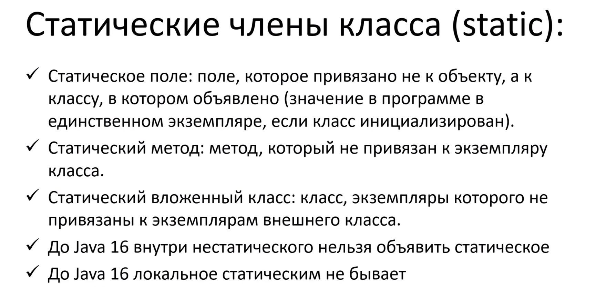

### Программирование на Java, Тагир Фаридович Валеев

[url](https://compscicenter.ru/courses/java/nsk/2022-spring/)

")

#### Классы
(стол - объект, идея стола - класс)

#### Метод

#### Конструктор

#### Объекты
- неизменяемый объект

- record (неизменяемый объект) данные и ничего, кроме данных.

- статические члены класса

- Утилитные классы

- Методы Object

  (верхние три и нижние два можно переопределять)

