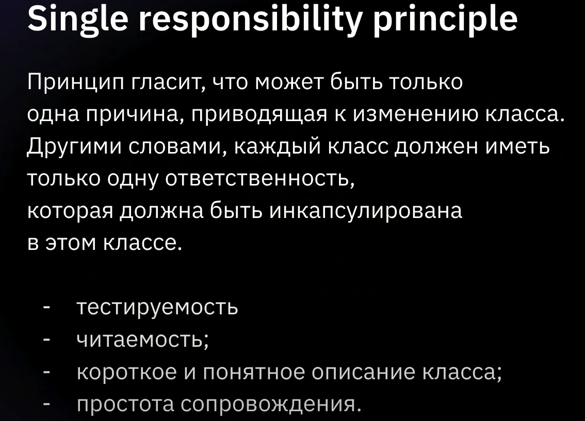
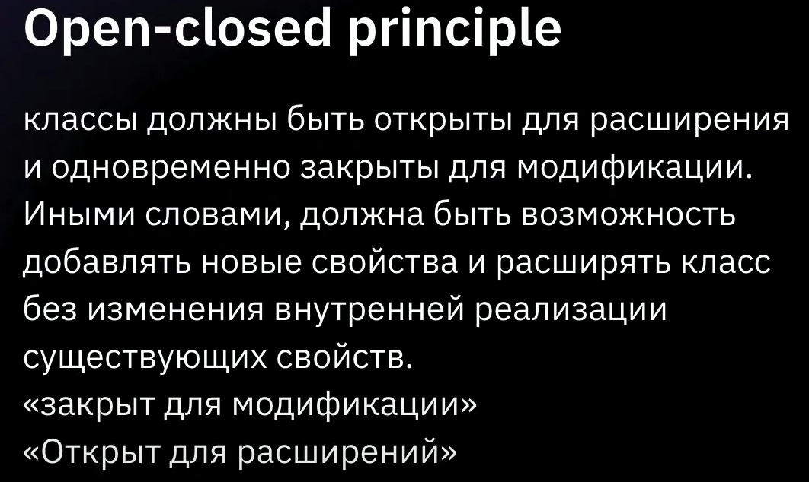
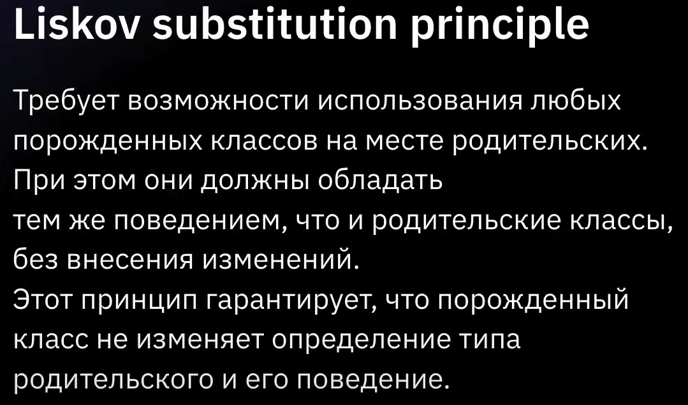
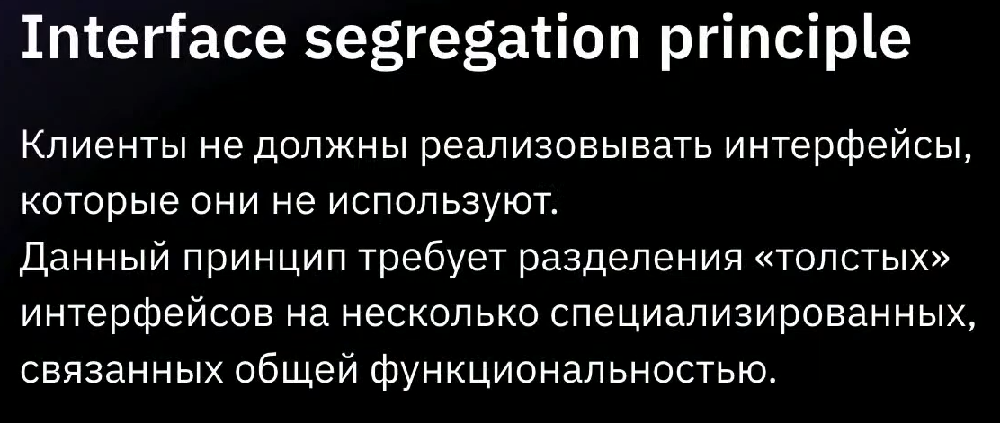
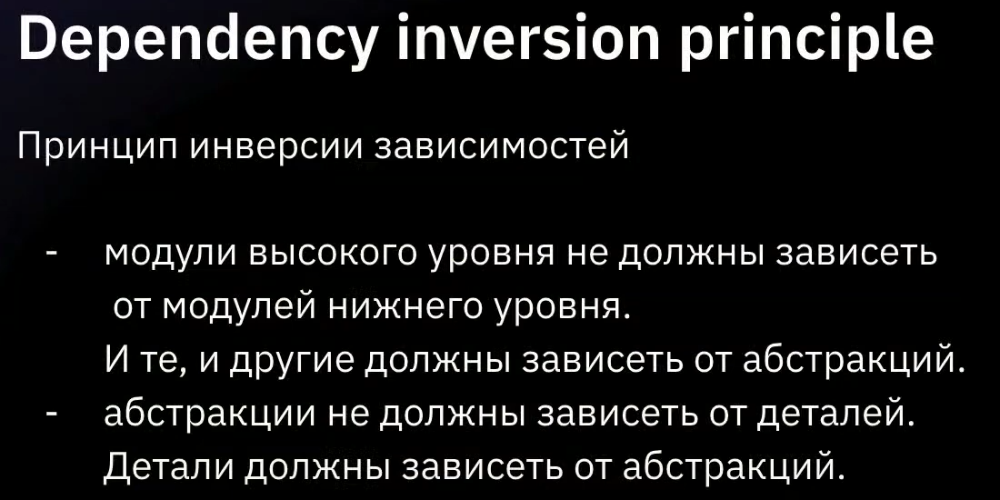

## SOLID принципы проектирования
- Single Responsibility - Принцип единой ответственности
- Open-closed Principle - Принцип открытости / закрытости
- Liskov`s Substitution - Принцип подстановки Барбары Лисков
- Interface Segregation Principle - Принцип разделения интерфейса
- Dependency Inversion Principle - Принцип инверсии зависимостей

